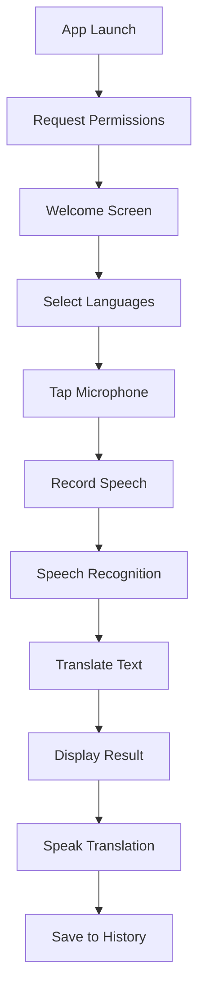

# Voice Translator 🌍🎤

A **modern iOS app** that provides **real-time speech-to-speech translation** using Apple's native frameworks. Speak in one language, hear the translation in another - it's that simple!


## ✨ Features

🎤 **Speech Recognition** - Advanced speech-to-text using Apple's Speech framework  
🌐 **Real-time Translation** - Instant translation powered by Apple's Translation framework  
🔊 **Text-to-Speech** - Natural voice synthesis in multiple languages  
📱 **Modern UI** - Beautiful SwiftUI interface with smooth animations  
🔄 **Language Swapping** - Quick language pair switching  
📝 **Translation History** - Keep track of recent translations  
🔒 **Privacy First** - All processing happens on-device using Apple's frameworks  

## 🚀 How It Works

1. **Select Languages** - Choose your source and target languages
2. **Tap & Speak** - Hold the microphone button and speak naturally
3. **Get Translation** - See the text translation and hear it spoken aloud
4. **Review History** - Access your recent translations anytime

## 📱 Screenshots

*Note: Add screenshots here when running on device*

## 🛠 Technical Architecture

### Core Components

- **Speech Recognition Service** - Handles voice input and speech-to-text conversion
- **Translation Service** - Manages text translation between languages  
- **Text-to-Speech Service** - Converts translated text back to speech
- **Translation View Model** - Coordinates all services and manages app state

### Supported Languages

- 🇺🇸 English
- 🇪🇸 Spanish  
- 🇫🇷 French
- 🇩🇪 German
- 🇮🇹 Italian
- 🇵🇹 Portuguese
- 🇷🇺 Russian
- 🇯🇵 Japanese
- 🇰🇷 Korean
- 🇨🇳 Chinese
- 🇸🇦 Arabic
- 🇮🇳 Hindi

## 📋 Requirements

- **iOS 15.0+** (Required for Translation framework)
- **Xcode 14.0+**
- **Swift 5.8+**
- **Device with microphone** (for speech input)

## 🔧 Installation & Setup

### Clone the Repository

```bash
git clone https://github.com/yourusername/VoiceTranslator.git
cd VoiceTranslator
```

### Open in Xcode

```bash
open Package.swift
```

### Build and Run

1. Select your target device or simulator
2. Press `Cmd + R` to build and run
3. Grant microphone and speech recognition permissions when prompted

## 🏗 Project Structure

```
VoiceTranslator/
├── Sources/VoiceTranslator/
│   ├── VoiceTranslatorApp.swift          # App entry point
│   ├── Models/
│   │   ├── Language.swift                # Language model
│   │   └── TranslationResult.swift       # Translation result model
│   ├── Services/
│   │   ├── SpeechRecognitionService.swift # Speech-to-text
│   │   ├── TranslationService.swift       # Text translation
│   │   └── TextToSpeechService.swift      # Text-to-speech
│   ├── ViewModels/
│   │   └── TranslationViewModel.swift     # Main view model
│   ├── Views/
│   │   ├── ContentView.swift             # Main app view
│   │   └── Components/                   # Reusable UI components
│   └── Supporting Files/
│       └── Info.plist                    # App permissions
└── Tests/VoiceTranslatorTests/
    └── VoiceTranslatorTests.swift        # Comprehensive tests
```

## 🔐 Permissions

The app requires the following permissions:

- **Microphone Access** - To record speech for translation
- **Speech Recognition** - To convert speech to text

These permissions are automatically requested when the app launches.

## 🧪 Testing

Run the comprehensive test suite:

```bash
swift test
```

### Test Coverage

- ✅ Model validation and data integrity
- ✅ Service initialization and error handling  
- ✅ View model state management
- ✅ Language selection and swapping
- ✅ Translation history management
- ✅ Error handling and edge cases
- ✅ Performance benchmarks

## 🎨 UI Components

### Main Components

- **ContentView** - Root app view with navigation
- **LanguageSelectionView** - Language picker header
- **VoiceControlsView** - Microphone and control buttons
- **TranslationCardView** - Displays translation results
- **LiveRecognitionView** - Shows real-time speech recognition
- **WelcomeView** - Onboarding and feature introduction

### Design Principles

- **Native iOS Design** - Follows Apple's Human Interface Guidelines
- **Accessibility** - VoiceOver and accessibility support
- **Dark Mode** - Full dark mode compatibility
- **Responsive** - Works on all iPhone and iPad sizes

## 🔄 App Flow



## 🚧 Future Enhancements

- [ ] **Offline Translation** - Support for offline language packs
- [ ] **Conversation Mode** - Back-and-forth conversation support
- [ ] **Photo Translation** - OCR and camera-based translation
- [ ] **Favorites** - Save frequently used phrases
- [ ] **Custom Voices** - Additional voice options
- [ ] **Apple Watch Support** - Quick translations on the wrist
- [ ] **Shortcuts Integration** - Siri Shortcuts support

## 🤝 Contributing

Contributions are welcome! Please feel free to submit a Pull Request.

### Development Setup

1. Fork the repository
2. Create a feature branch (`git checkout -b feature/amazing-feature`)
3. Commit your changes (`git commit -m 'Add amazing feature'`)
4. Push to the branch (`git push origin feature/amazing-feature`)
5. Open a Pull Request

## 📄 License

This project is licensed under the MIT License - see the [LICENSE](LICENSE) file for details.

## 🙏 Acknowledgments

- **Apple** - For providing excellent Speech, Translation, and AVFoundation frameworks
- **SwiftUI** - For making beautiful iOS interfaces accessible
- **Community** - For inspiration and feedback

---

**Made with ❤️ and Swift** - Ready to break down language barriers, one conversation at a time! 🌍
